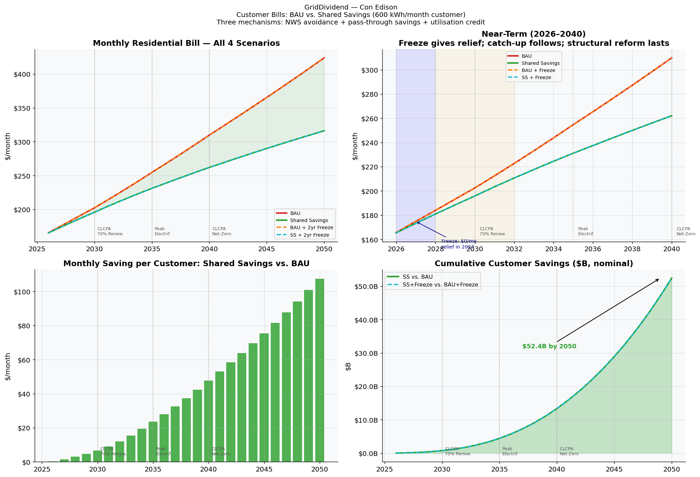
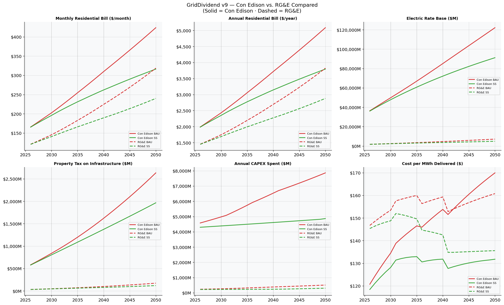

# GridDividend

**An open-source policy simulation framework for electric utility shared savings.**

*Dr Robert A. F. Currie, May 2026*

AI has been used extensively in the creation of this tool.

---

## What it does

GridDividend models what happens to customer electricity bills and utility finances when a regulatory framework replaces traditional infrastructure build-out with a **shared savings mechanism**: Non-Wires Solutions (NWS) — batteries, demand response, managed EV charging — defer capital investment, and the resulting savings are split between the utility (as an earnings incentive) and customers (as bill reductions).

The model runs **2026–2050** projections across four scenarios per utility:

| Scenario | Description |
|----------|-------------|
| BAU | Business As Usual — traditional CAPEX build-out, no reform |
| BAU + Freeze | BAU with a temporary rate freeze (shows catch-up cost) |
| Shared Savings | NWS avoidance + savings pass-through to customers |
| Shared Savings + Freeze | Shared savings with a near-term rate freeze |

Currently models two New York utilities: **Con Edison** (Case 25-E-0072, approved Jan 2026) and **RG&E** (Case 25-E-0379, temporary rates Jun 2026).

---

## Key result



Under shared savings, a typical Con Edison residential customer (600 kWh/month) avoids hundreds of dollars per year in bill increases that BAU regulation would otherwise impose. Cumulative customer savings reach \$52B by 2050 across Con Edison's 3.7M customers.



---

## Three mechanisms

1. **NWS CAPEX avoidance** — Flexible DER defers growth-driven infrastructure spending. Avoidance ramps from ~20% of eligible CAPEX in 2026 to ~80% at programme maturity, consistent with GB flexibility market outcomes (UKPN DSO, 2024/25) and the Brattle Ontario NWS study (2026).

2. **Utilisation credit** — Managed flexible load uses existing system headroom without triggering proportional new build, spreading fixed costs over more kWh. Source: Brattle/Utilize Coalition, *The Untapped Grid* (2026).

3. **Shared savings split** — Default: utility retains 30% of the savings pool (consistent with NY PSC NWS incentive precedent); 70% passes through to customer bills.

---

## How to use

**Option A — Conda (recommended if you have Anaconda/Miniconda):**
```bash
git clone https://github.com/your-username/GridDividend.git
cd GridDividend
conda activate base          # or any environment with the packages below
jupyter notebook GridDividend_v1.0.ipynb
```

**Option B — pip:**
```bash
git clone https://github.com/your-username/GridDividend.git
cd GridDividend
pip install -r requirements.txt
jupyter notebook GridDividend_v1.0.ipynb
```

Then edit any parameter in **Section 1** and choose **Kernel → Restart & Run All**.

The notebook is entirely self-contained — no external data files are required.

---

## Model caveats

This is a **strategic policy simulation**, not a utility planning model or rate-case replica. Key limitations:

- **Spatially aggregate.** NWS is modelled as a system-wide percentage of eligible CAPEX. Real outcomes depend on feeder-level constraint types and DER siting. Individual feeders will range from zero NWS benefit (fault-current or asset-condition driven) to near-complete deferral (growth-driven, thermally constrained, demand-coincident).
- **Not a forecast.** Results show direction and order of magnitude. Key sensitivities are the NWS avoidance rate at maturity and the electrification ramp — see Section 8 (Sensitivity Analysis).
- **RG&E data is provisional.** The PSC set temporary rates in June 2026; the final order on Case 25-E-0379 is still pending. Parameters should be updated when the order issues.

Full caveats are in **Section 10** of the notebook.

---

## Citation

If you use this work in research or publications, please cite:

> Currie, R. (2026). *GridDividend: Open Source Utility Shared Savings Framework*. GitHub Repository.

---

## License

MIT
